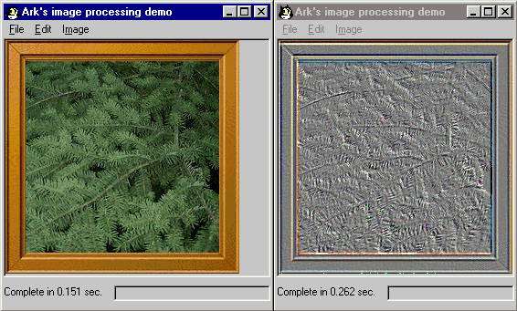



## Digital image processing

### Description

VB PhotoShop clone. Various image effects - rotation, flip, fade, color manipulation, fish-eye,swirle etc plus various filters - soften/sharpen/custom etc. A lot of undocumented staff including using MSOffice graphic convertion filters, pure VB calling dll functions by its pointers, assembly language inside VB and much more!
 
### More Info
 
Note: running code from IDE is slow, but if compile into native code with Fast optimization and checking all check boxes in advanced tab, it run almost as fast as commercial/C++ products. Code tested on w98/IE5.0/MSOffice_97. Since I used a lot of undocumented staff, some functions may not work on newer platforms.

             |
---                |---
**Submitted On**   |2002-11-21 20:41:58
**By**             |[Ark](https://github.com/Planet-Source-Code/PSCIndex/blob/master/ByAuthor/ark.md)
**Level**          |Advanced
**User Rating**    |4.9 (268 globes from 55 users)
**Compatibility**  |VB 4\.0 \(32\-bit\), VB 5\.0, VB 6\.0
**Category**       |[Graphics](https://github.com/Planet-Source-Code/PSCIndex/blob/master/ByCategory/graphics__1-46.md)
**World**          |[Visual Basic](https://github.com/Planet-Source-Code/PSCIndex/blob/master/ByWorld/visual-basic.md)
**Archive File**   |[Digital\_im1508111252002\.zip](https://github.com/Planet-Source-Code/ark-digital-image-processing__1-41320/archive/master.zip)

